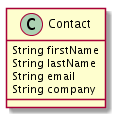
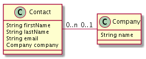

# TP sur l'utilisation de Flyway pour le versionnement de BDD

L'objectif du TP est d'utiliser Flyway pour gérer le versionnement d'un gestionnaire de contacts.

La documentation de l'API de jOOQ est [https://www.jooq.org/doc/3.10/manual/sql-building/sql-statements/](ici).

## Initialiser l'utilisateur et la BDD du TP

**À ne faire qu'une fois** pour créer l'utilisateur MySQL et sa base dédiée au TP.

* se connecter au client MySQL avec l'utilisateur MySQL root:

```bash
mysql -u root -p
```

* créer l'utilisateur et sa base :

```sql
CREATE USER "daoormcqrsuser"@"localhost";
SET password FOR "daoormcqrsuser"@"localhost" = password('daoormcqrspwd');
CREATE DATABASE daoormcqrs DEFAULT CHARACTER SET utf8 COLLATE utf8_general_ci;
GRANT ALL ON daoormcqrs.* TO "daoormcqrsuser"@"localhost";
exit;
```

Selon votre environnement :

* renommez "daoormflywayuser"@"localhost" en "daoormflywayuser" dans les requêtes, mais rajoutez l'accès `localhost` dans PhpMyAdmin ensuite
* adaptez le port utilisé par MySQL (`3306` en général, parfois `8889` dans PhpMyAdmin)
* adaptez la configuration MySQL dans `src/main/resources/application.yml`

## Étape 1 : initialisation du schéma

* annoter `Contact` avec les annotations `javax.persistence.*`
* créez un fichier vide `src/main/resources/db/migration/V1.0.0__init.sql`
* démarrer l'application et renseigner `V1.0.0__init.sql` avec la requête de création de table générée par Hibernate
* désactiver la génération de schéma par Hibernate (sinon il va détruire vos données à chaque redémarrage) :

Le schéma devrait correspondre au POJO :



L'application devrait être en ligne sur http://localhost:9090/api/contacts/.

```yaml
spring.jpa.generate-ddl: false
spring.jpa.hibernate.ddl-auto: none
```

### Étape 2 : création de contact

* ajouter la méthode qui permet de créer un contact et de renvoyer son URL :

```java
public class ContactController {
    @PostMapping("/")
    ResponseEntity createContact(@RequestBody Contact contactToCreate) {
        this.contactRepository.save(contactToCreate);
        URI location = ServletUriComponentsBuilder.fromCurrentRequest().path("/{id}")
                .buildAndExpand(contactToCreate.id).toUri();
    
        return ResponseEntity.created(location).build();
    }
}
```

* utilisation de cURL pour créer un contact avec une requête POST

```sh
# JSON à la main
curl -i -d '{"firstName":"Harry", "lastName":"Cover", "email":"harry@cov.er", "company":"MyDigitalSchool"}' -H "Content-Type: application/json" -X POST http://localhost:9090/api/contacts/
# envoyer un fichier JSON avec '@'
curl -i -d @harrycover.json -H "Content-Type: application/json" -X POST http://localhost:3000/api/contact
```

### Étape 3 : lecture de tous les contacts
* remplacer la méthode `home()` existantes par un appel à `this.contactRepository.findAll()`

### Étape 4 : lecture d'un contact par son identifiant

* rajouter la fonction permettant de lire un contact par son identifiant

```java
public class ContactController {
    @GetMapping("/{id}")
    Contact getContactById(@PathVariable Long id) {
        return this.contactRepository.findOne(id);
    }
}
```

### Étape 5 : évolution du schéma de BDD

* écrire le script SQL Flyway de migration vers le schéma :



* créer `Company` et `CompanyRepository`, mettre à jour le modèle métier (@Entity sur Company et relation @ManyToOne sur Contact) pour que l'application continue de fonctionner.

## Documentation de Spring
Annotations de Spring pour instrumenter les méthodes de contrôleurs REST : https://docs.spring.io/spring/docs/current/javadoc-api/org/springframework/web/bind/annotation/package-summary.html.
* @GetMapping, @PostMapping(...endpoint)
* @RequestBody : corps de requête (POST en général)
* @PathVariable : élément d'une URL d'API (un identifiant de ressource par exemple)
* @RequestParam : argument dans l'url d'un endpoint (critères de recherche par exemple)

Voir aussi le tutorial https://spring.io/guides/tutorials/bookmarks/.

Intégration [SpringBoot-Flyway](https://flywaydb.org/documentation/plugins/springboot), application de [démo](https://github.com/spring-projects/spring-boot/tree/master/spring-boot-samples/spring-boot-sample-flyway)

